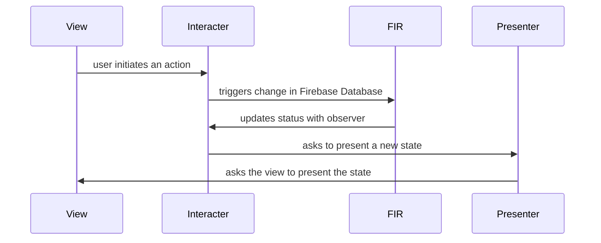

# FIRChat

A sample iOS serverless chat app that uses Firebase Database as the sole backend.

## Overview

The app is written with VIP clean architecture in mind in order to keep a one-way app flow.

### A Scene

### Scenes

Each scene follows the above app flow. Each scene is represeted with its corresponding View (ViewController), interacter and presenter. There are two scenes in this project sample.

- Users 
  - shows who's online
  - allows user to select a conversation partner
- Conversations
  - allows chatting with the selected conversation parter
  - displays chat history

## Requirements

In order to run this sample project, you need to

- setup your Firebase free account
- create a Firebase app project 
- match the app bundle name of this sample project to your newly created Firebase app project

### How to run 

- Run a `pod install`in the sample project folder
- run FIRChat in Xcode 